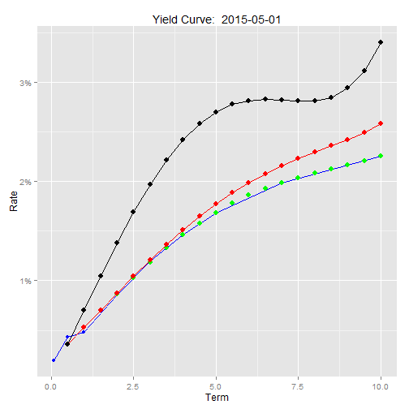

## Overview
The objective of this project was to learn to create data driven web applications using Shiny and presentations using Slidify or RStudio Presenter. 

For the subject material, I chose to create an application that looks at interest rate data and performs the necessary calculations to break down the interest rate curves into the components used to price fixed income financial instruments.  

---
## Data
The data used for the application and this presentatioin is Federal Reserve Economic Data (FRED). I used the Quandl API in R to pull the data and saved it to a file to eliminate the need to call the API with each use. 
* Data for 65 different dates, monthly from 1/1/2010 to 5/1/2015
* Data for each date consists of 9 data points with Maturities range from 1 month to 10 years
* Below is a graph showing all yield curves

---
## Calculations
For each date selected, the curves are processed using the following steps:
* Fit a cubic-polynomial model to the 9 data points and predict a full set of 20 points 6 months apart
* Bootstrap those 20 points to solve for the zero coupon rate and discount rate at each point  
* Use the zero coupon rates to determine 6 month forward rates for each point on the curve
* Graph the curves and return it to the app

---
## Results
The following graph shows the results for the first date in the data set.

 
